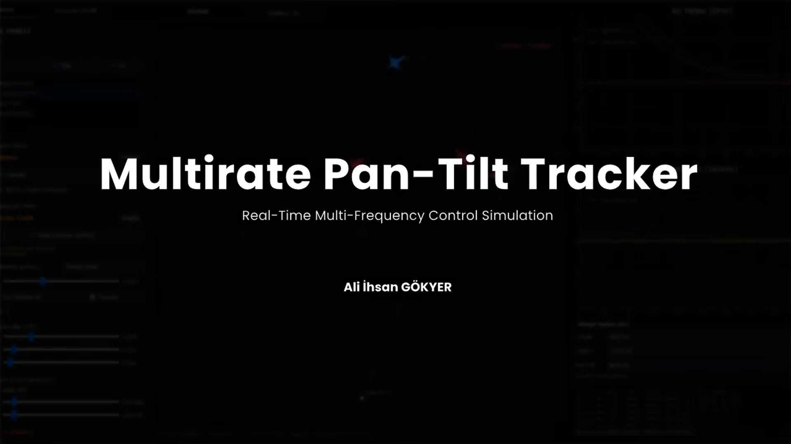

# Multi-Rate Pan-Tilt Target Tracking System

A real-time, closed-loop tracking and control simulation for a two-axis (azimuth/elevation) pan-tilt platform, built with Python / PyQt5 / OpenGL.

The system includes independently-clocked target/control/actuator loops, PID control, a dependency-free constant-velocity Kalman filter, multi-target selection, and an actuator simulator that models hardware constraints.

**Highlighted results:**
- Under noisy position measurement (σ = 0.15 m), Kalman-based lead prediction improved RMSE by **87.8–97.2%** over finite-difference extrapolation.
- Under a hard ±185° azimuth limit, a persistent lock-on failure that occurs when the target crosses behind the platform was fixed with a limit-aware angular path resolution (never locked over 2000 ticks → locked in 346 ticks ≈ 5.8 s at 60 Hz, with the azimuth acceleration limit set to 2000 deg/s²).
- A cooldown + margin mechanism in multi-target auto-selection reduced target switches from 300 to 2 over 300 ticks in a synthetic test (flip-flop prevention).

## Demo

[](https://youtu.be/XFFDIRdZATw)
 
*Click the thumbnail to watch the system in action (YouTube).*

## Table of Contents

1. [Results](#results)
2. [Demo](#demo)
3. [System Architecture](#system-architecture)
4. [Multi-Rate Loop Design](#multi-rate-loop-design)
5. [Tracking and Control](#tracking-and-control)
6. [Actuator / Hardware Realism Layer](#actuator--hardware-realism-layer)
7. [Featured Problem: Limit-Aware Tracking](#featured-problem-limit-aware-tracking)
8. [Project Structure](#project-structure)
9. [Installation](#installation)
10. [Limitations](#limitations)
11. [Planned Improvements](#planned-improvements)
12. [Author](#author)

---

## Results

### Noisy-measurement benchmark

The lead-prediction pipeline was validated by comparing two methods: naive (finite-difference) extrapolation of the form position + velocity × `LEAD_TIME_SEC`, and `CVKalmanFilter2D.predicted_position()`. Both outputs were measured as RMSE against the target's true position `LEAD_TIME_SEC = 0.35s` ahead.

**Methodology:** Gaussian measurement noise σ = 0.15 m, 3000 ticks at the `DT_TARGET` step (60 Hz), each of three target profiles (`normal`, `aggressive`, `slow`) tested separately. Metric: position RMSE at the lead-time horizon.

| Target profile | Finite-difference RMSE | Kalman RMSE | Improvement |
|---|---:|---:|---:|
| normal | 6.465 m | 0.356 m | **94.5%** |
| aggressive | 6.443 m | 0.787 m | **87.8%** |
| slow | 6.442 m | 0.181 m | **97.2%** |

Deriving velocity from a noisy position over a single tick (`Δt = 1/60s`) amplifies measurement noise by `1/Δt`; a 15 cm position error thus turns into a very large velocity error. The Kalman filter substantially suppresses this effect by jointly estimating position and velocity.

> **Note:** This benchmark does not use the output of the planned YOLO-based image detector — the detector is not integrated yet. The σ = 0.15 m synthetic Gaussian noise is an *assumption* meant to represent the accuracy of a plausible image-based measurement. Once a real detector is integrated, this should be re-measured against its actual noise characteristics.

### Noise-free (ground-truth) input comparison

The same test was repeated without measurement noise (the simulation's current default — `Target.step()` feeds the filter with its own perfect position):

| Target profile | Naive RMSE | Kalman RMSE |
|---|---:|---:|
| normal | 0.175 m | 0.201 m |
| aggressive | 0.445 m | 0.489 m |
| slow | 0.050 m | 0.063 m |

Here naive extrapolation is slightly better — an expected result. When the input is already noise-free, the filter's smoothing has no noise to clean up, and that smoothing itself becomes a small lag cost. This comparison confirms that the filter's benefit only appears in the noisy regime — exactly the regime the planned image-based (YOLO) input will operate in.

---

## System Architecture

```
   Target (ground-truth / noisy measurement)
          │ measurement
          ▼
   CVKalmanFilter2D  ──► predicted_position(lead_time)
          │
          ▼
   TargetManager  ──► auto-select (nearest/center, flip-flop prevention)
          │
          ▼
   PanTiltTracker (state machine: COARSE / FINE / LOCKED)
          │ hysteresis + debounce
          ▼
   PID Controller  ──► angular velocity command
          │
          ▼
   Acceleration Limiter
          │
          ▼
   PanTiltDeviceSimulator (hardware realism layer)
          │
          └──► read_position_deg()  ──► UI / telemetry / control loop (feedback)
```

The `core` layer has no dependency on `ui` — control/simulation logic can be unit-tested independently of the interface. `core/kalman.py` is similarly kept isolated from `core/target.py`: the filter is general-purpose and has no knowledge of `config.py` or target profiles; mapping process-noise calibration to target type is `target.py`'s responsibility.

---

## Multi-Rate Loop Design

| Loop | Frequency | Responsibility |
|---|---|---|
| Target update | 60 Hz | Target physics (OU-type smooth random walk, boundary bounce) |
| Control loop | 120 Hz | Applies the PID gains from the UI to the controllers |
| Pan-tilt update | 60 Hz | Angular error computation, PID output, angle/velocity/acceleration integration, actuator physics |

Timing is executed with a fixed-`dt` accumulator model (`DT_TARGET`, `DT_CONTROL`, `DT_PANTILT`). If wall-clock elapsed time spikes abnormally due to window dragging or a GC pause, a `MAX_DT = 0.1s` ceiling and a `MAX_CATCHUP_STEPS = 10` limit prevent the loop from locking up while trying to catch up (spiral-of-death). `ui/main_window/loop.py` ties this loop to Qt's event loop (`QTimer`, `TICK_MS = 4`) — QTimer is used purely as a UI/scheduler trigger; the actual simulation time steps are managed independently by the accumulator via `DT_TARGET`, `DT_CONTROL`, and `DT_PANTILT`.

Note: this is a desktop Python/PyQt application and does not provide hardware-level hard real-time guarantees; the mechanisms above are intended to preserve the timing discipline of a soft real-time simulation loop.

---

## Tracking and Control

### PID Controller

```
Control loop     : 60 Hz (the PID runs inside the pan-tilt update step)
error             : degrees
integral          : degree·s
derivative        : degrees/s (low-pass filtered, α = 0.25)
output            : angular velocity command
output limit      : ±2.0 deg/tick = ±120 deg/s @ 60 Hz (PID_OUTPUT_LIMIT)

PID_KP = 0.34   PID_KI = 0.015   PID_KD = 0.060
PID_INTEGRAL_LIMIT = 12.0   (anti-windup)
```

The coefficients were tuned experimentally on the simulation based on the tracking error and oscillation behavior observed across the different target profiles (normal/aggressive/slow).

- **Anti-windup:** the integral term is clamped so sustained large errors cannot drive the controller into saturation.
- **Derivative filtering:** small noise from the target's random-walk motion could be amplified by the D term and show up as chatter in motor output, so the derivative term is passed through a low-pass filter.
- **Lead prediction:** the controller aims not at the target's instantaneous position, but at a position projected `LEAD_TIME_SEC = 0.35s` ahead using the Kalman velocity estimate.

### Coarse / Fine / Lock State Machine

- **COARSE:** fast approach at a fixed ceiling speed (`8.0°/tick`) while the error is large
- **FINE:** PID engages for precise approach once the error drops below `2.5°`
- **LOCKED:** lock state is entered once the error drops below `1.2°`

Switching modes on a single threshold causes mode chatter every tick when the error oscillates around that threshold. This is prevented with two mechanisms:

1. **Hysteresis (Schmitt-trigger logic):** the exit threshold is kept higher than the entry threshold (`COARSE_REENTRY = 4.0°`, `LOCK_EXIT = 2.16°`)
2. **Debounce:** a state change (mode or lock) becomes permanent only once the new state persists for `MODE_SWITCH_CONFIRM_TICKS = 6` (~96 ms) consecutive ticks

Hysteresis and consecutive-tick confirmation are used together to prevent small target movements around a threshold from causing unnecessary mode switches.

### Target State Estimation — CV Kalman Filter

`CVKalmanFilter2D` (`core/kalman.py`) is a constant-velocity Kalman filter written in pure Python (no NumPy dependency) with state vector `[px, py, vx, vy]`. The 4×4 covariance propagation and the 2×2 innovation-covariance inverse are written out explicitly by hand. The dependency was deliberately omitted, since it was judged unnecessary for a problem of this size (4×4/2×2).

Each `Target` carries its own filter; process noise (`q_vel`) is scaled per target profile: the `aggressive` profile uses higher process noise so the filter trusts the constant-velocity model less and adapts faster to sudden maneuvers; the `slow` profile uses lower process noise for heavier smoothing. This filter is designed as the estimation layer the planned YOLO-based image input will sit on top of (see [Planned Improvements](#planned-improvements)).

### Multi-Target and Route System

- Adjustable target count between 1–12, three target profiles
- Automatic target selection: `nearest` or `center` strategy
- **Flip-flop prevention:** a new candidate must beat the current target by at least a margin (`0.6 m` / `4.0°`), and at least `AUTO_SWITCH_COOLDOWN_SEC = 1.2s` must have passed since the last switch. In a synthetic test, this reduced switch count from 300 to 2 over 300 ticks.
- Waypoint routes: `loop` / `stop` / `pingpong` end-of-route behaviors, adjustable speed 0.2–6.0 m/s

---

## Actuator / Hardware Realism Layer

`core/pantilt_hardware.py` is an independent layer built on top of the ideal angle/velocity/acceleration integration, modeling physical and communication constraints one would encounter in a real servo system — it has no dependency on `simulator.py` or `target.py`, and can be toggled at runtime (when disabled, the system behaves identically to before this layer existed).

| Model | Purpose |
|---|---|
| Speed envelope | No motion below `MIN_SPEED` due to stiction, `MAX_SPEED` as the upper ceiling |
| Hard limit | Hard stop at `±185°` on the azimuth axis (to prevent cable entanglement) |
| Acceleration limit | Limits sudden velocity changes (when the hardware layer is enabled, the tracker's own acceleration limiter is disabled) |
| Command rate | Communication capacity constraint: the device does not accept commands faster than `COMM_MAX_COMMAND_RATE_HZ = 50 Hz`; intermediate commands are dropped |
| Velocity ripple | Small random fluctuation from the device's own internal controller (OU-type noise) |
| Angular resolution | Quantization to encoder/step resolution |
| Accuracy / repeatability | Accuracy: a fixed calibration bias per session. Repeatability: a random component re-drawn on each reading, representing repeated-positioning error (a simplified representation of mechanical effects such as backlash) |
| Settling time | The axis is considered "settled" once its velocity reaches zero and it remains within `SETTLING_BAND_DEG` continuously for `SETTLING_TIME_SEC` |

Two notions of position are kept separate: `true_position_deg` is the simulation's internal true physical position, while `read_position_deg()` is what the device reports externally (with resolution + accuracy + repeatability error applied) — the UI/telemetry/control loop always reads the latter.

Parameters can be adjusted at runtime, grouped by category, via a PyQt5 panel auto-generated from `HARDWARE_MENU_SCHEMA` (`hardware_panel.py`).

---

## Featured Problem: Limit-Aware Tracking

**Problem:** With a hard azimuth angle limit (`±185°`) enabled, while the pan-tilt is at `+170°` the target moves to `-170°` (since des_az is always computed via `atan2` in the `±180°` range, this is a real scenario that occurs any time the target genuinely passes behind the platform). The naive "shortest path" (`±180°`) calculation drives the axis toward the target until it hits the hard limit and gets stuck there — never recovering.

**Solution:** `PanTiltTracker._resolve_az_error()` selects, among the target angle's `±360°` equivalents, the one that stays within the hard limit and is closest to the current position — which, when needed, means taking the longer but actually reachable path instead of the shortest one.

**Result** — simulated end-to-end with `PanTiltDeviceSimulator` (hardware realism layer enabled, default hardware profile except that the azimuth/elevation acceleration limit is set to 2000 deg/s²). The platform starts at +170°, the target is static at -170° azimuth (8 m away), 2000 ticks at the `DT_PANTILT` step, 10 runs with different random seeds:

| | Before fix (naive ±180°) | After fix (`_resolve_az_error`) |
|---|---|---|
| Target lock achieved | No (0 of 10 runs, 2000 ticks) | Yes (10 of 10 runs, at tick 346 ≈ 5.8 s at 60 Hz) |
| Final azimuth | 185.0° (stuck at hard limit) | ≈ -169.7° |
| Final true angular error | 5.0° (persistent) | 0.3–0.4° |

For reference, a 340° rotation at the 60 deg/s azimuth speed limit takes about 5.7 s, so the lock time is close to the kinematic minimum.

> **Note:** With the default acceleration limit (150 deg/s²), the path resolution still selects the correct 340° route, but the COARSE mode overshoots the target and oscillates by about ±11° around it, and stable lock was reached in only a small minority of runs (about 4 of 30). The command in COARSE mode is not limited by braking distance when the hardware layer is enabled. See [Limitations](#limitations).

---

## Project Structure

```
pantilt_tracker/
├── core/
│   ├── kalman.py             # CVKalmanFilter2D (dependency-free)
│   ├── target.py              # Target physics, TargetManager
│   ├── pantilt_hardware.py    # Hardware realism layer
│   └── ...                    # Control loop, PID, route logic, state machine
├── ui/
│   ├── control_panel/          # Control panel (PID, route, target, hardware)
│   ├── main_window/            # Main window, simulation loop (QTimer)
│   └── radar_widget/           # 2D radar/map visualization
├── visualization/               # OpenGL-based 3D render pipeline
├── models/                      # STL 3D model assets
├── config.py                    # All system/control parameters
└── main.py
```

The UI layer is split by responsibility; drawing, coordinate transforms, and user interaction are kept in separate files within `radar_widget`, and within `control_panel` the UI interaction logic (`interactions.py`) is separated from the outward-facing API to core (`api.py`).

---

## Installation

```bash
git clone https://github.com/aligkyrr/multirate-pantilt-tracker.git
cd multirate-pantilt-tracker
pip install -r requirements.txt
python main.py
```

---

## Limitations

- Not validated on physical servo hardware; `pantilt_hardware.py` is based on parametric assumptions rather than a real datasheet.
- Target measurement is currently modeled with ground-truth or synthetic Gaussian noise; a camera/image pipeline is not yet integrated. The Kalman filter has not yet been validated against real image-detector output — the noisy-measurement benchmark uses synthetic noise, not actual YOLO output.
- With the default acceleration limit (150 deg/s²) and the hardware layer enabled, the COARSE mode overshoots and oscillates around the target after a very large initial error (for example, the limit-aware scenario); stable lock is not reliably achieved. A braking-distance limit on the velocity command in the hardware path is a known open item.
- The Python/PyQt + QTimer architecture is soft real-time; it does not provide hard real-time timing guarantees.
- PID coefficients were tuned experimentally on specific target profiles; re-tuning may be required for targets with different dynamics.

---

## Planned Improvements

- Feeding the Kalman filter with bounding-box/centroid measurements from a YOLO-based image detector instead of ground-truth target position
- Hardware integration (servo motor driver / Raspberry Pi deployment)
- Network-based remote control interface

---

## Author

**Ali İhsan Gökyer**
Electrical & Electronics Engineering Student